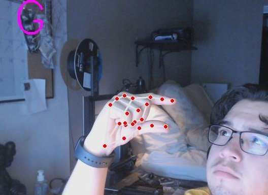

___

# 
**Sign Language Tracker** 

---

 
The inspiration for this project was from my deaf cousin. Growing up, there was always a language barrier between her and I. Now that I have grown sufficient knowledge in programming, I thought it would be great to create this program that in an effort to learn sign language and communicate with her more effectively. 

 

This project aims to recognize the sign language alphabet through the use of computer vision. This 
would be don using a mediapipe model that was trained on thousands of images of hands. With this model, I was able to interpret sign language of my right hand

 

    

Sign Language Tracking

 In any future iterations done on this project, I would hope to be able to recognize the letters using both hands. I would also look into using machine learning to train a model on sign language gestures as the system that is currently being used is built specifically for my hand. 
 

Having a trained model for this system, any user would be able to quickly and effectively use it to learn sign language.

